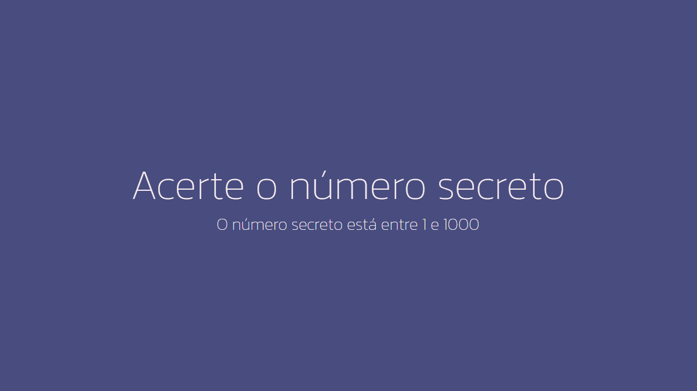

<h1 align="center"> &#127918; Número Secreto  </h1>

Game desenvolvido em Javascript que tem como objetivo final adivinharmos um número secreto através de comando de voz.  

  

Este conteúdo foi desenvolvido através de orientação do Guilherme Lima através da plataforma Alura.

## 🚀 Tecnologias

Esse projeto foi desenvolvido com as seguintes tecnologias:

- HTML e CSS
- JavaScript
- Git e Github
- Figma

## 💻 Projeto

O Número Secreto é um game de adivinhação através de comando de voz.

---

Feito com ♥ 